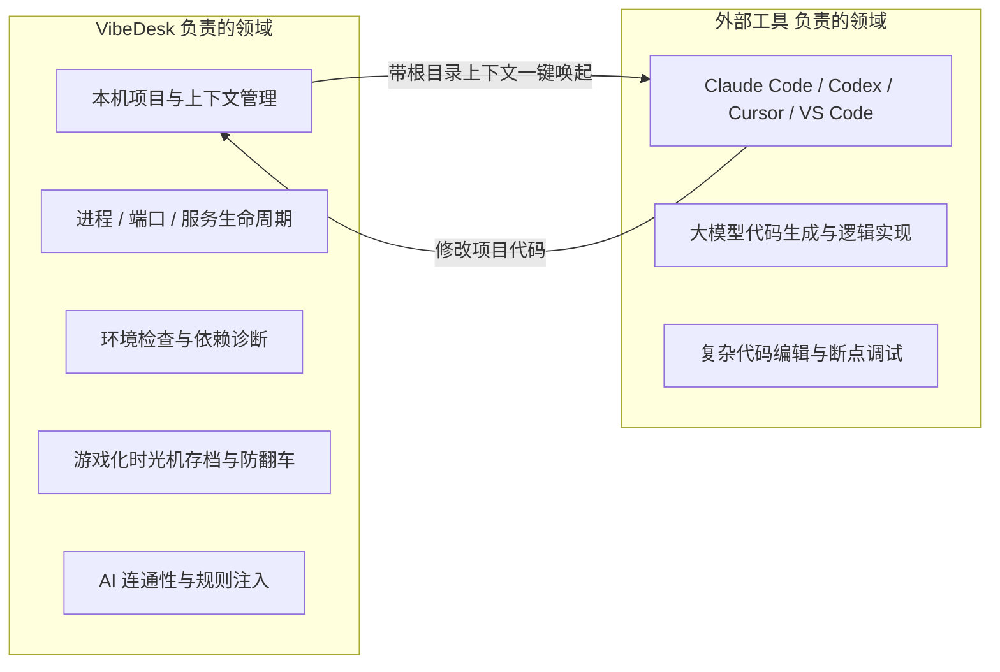
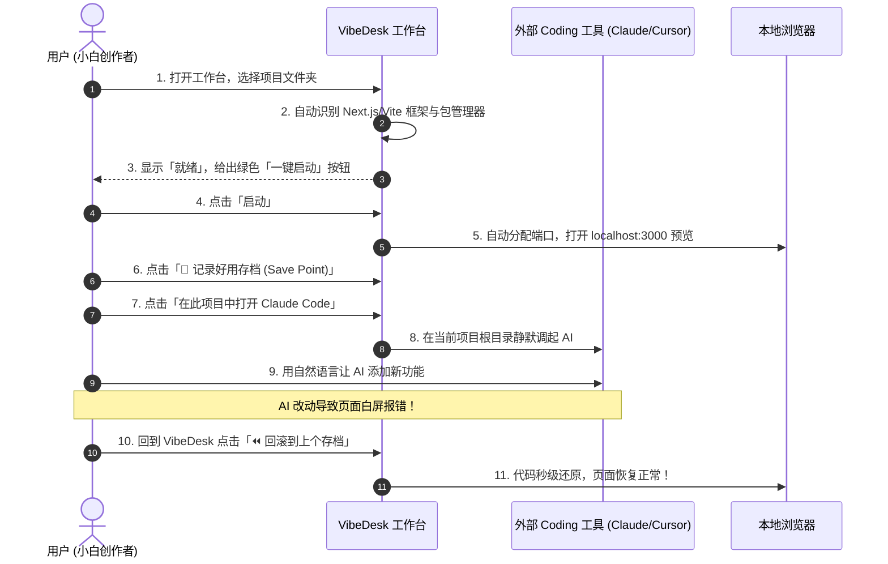
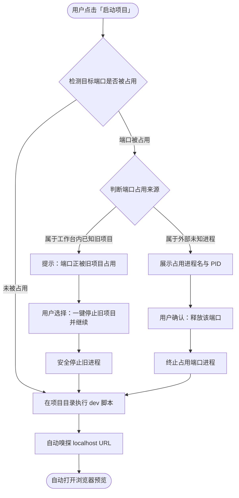
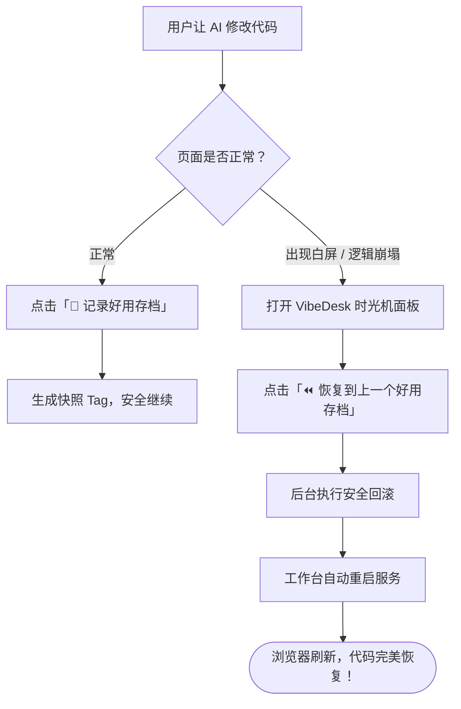
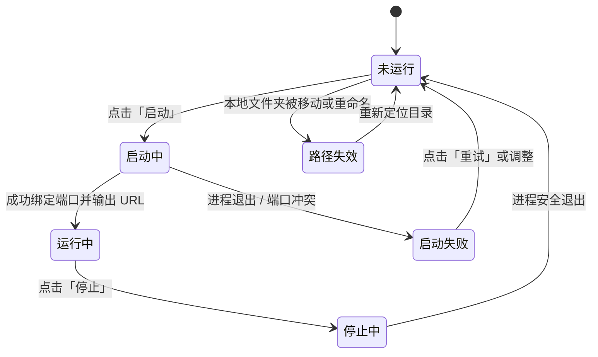
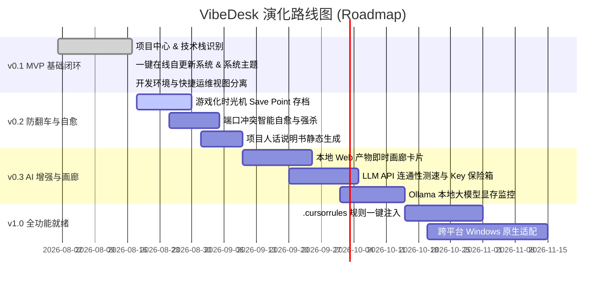

# VibeDesk：Vibe Coding 新手本机总控工作台

**Product Requirements Document · PRD v1.0 (Unified Specification)**

> **一句话定位**
>
> 让不会开发的人，也能看懂、启动、管理、备份和维护自己电脑上的 Vibe Coding 项目。  
> 工作台负责**“本机上下文、运行秩序与安全兜底”**，Claude Code / Codex / Cursor / VS Code 负责 **“AI 编码与交互”**。

| **文档属性** | **说明** |
| :--- | :--- |
| **文档版本** | PRD v1.0 (融合版：VibeDesk 核心规范 + 本机底层技术底座) |
| **产品阶段** | MVP 交付与迭代规划 |
| **目标用户** | Vibe Coding 新手、小白、独立创作者、非专业开发者、产品/设计/运营 |
| **产品形态** | macOS / Windows 单一自包含轻量桌面应用（Rust + Embedded Web） |
| **核心边界** | **不自研 Coding Agent，不替代 IDE**，专注于“Agent 之前、之中与之后”的本机秩序 |

---

## 目录

- [01 产品概述与核心定位](#01-产品概述与核心定位)
- [02 问题背景与产品机会](#02-问题背景与产品机会)
- [03 目标用户画像与核心场景](#03-目标用户画像与核心场景)
- [04 产品目标与非目标 (MVP 边界)](#04-产品目标与非目标-mvp-边界)
- [05 核心设计原则](#05-核心设计原则)
- [06 信息架构与导航设计](#06-信息架构与导航设计)
- [07 核心功能模块详细需求 (PRD Specs)](#07-核心功能模块详细需求-prd-specs)
- [08 关键用户流程与自愈机制](#08-关键用户流程与自愈机制)
- [09 状态机模型与安全安全边界](#09-状态机模型与安全安全边界)
- [10 技术架构与非功能性需求 (NFR)](#10-技术架构与非功能性需求-nfr)
- [11 数据指标体系与埋点规范](#11-数据指标体系与埋点规范)
- [12 分期实施演化路线图](#12-分期实施演化路线图)
- [13 MVP 验收标准 (Definition of Done)](#13-mvp-验收标准-definition-of-done)
- [14 附录：核心页面草图与交互模型](#14-附录核心页面草图与交互模型)

---

## 01 产品概述与核心定位

### 1.1 产品定义
**VibeDesk** 是面向 AI Vibe Coding 时代的**轻量级本机开发工作台**。  
它不负责“替用户写代码”，而是将小白在开发过程中最头疼的 **项目路径、开发进程、端口占用、环境依赖、环境变量、Git 状态、API 连通性与外部 AI 工具** 统一整理成一个小白完全看得懂、点得动的图形化控制台。

用户在完全不知道 `cd`、`npm/pnpm`、`localhost:3000`、`PID`、`.env`、`git reset` 等底层概念的情况下，即可流畅完成：
**“找到项目 ➔ 启动项目 ➔ 自动打开预览 ➔ 在当前目录调用 AI 工具 ➔ 实时查看状态 ➔ 代码写崩一键存档回滚 ➔ 停止服务”** 的全生命周期工作流。

### 1.2 核心价值矩阵

| 用户现实困惑 | 传统开发者的做法 | VibeDesk 的解决方案 |
| :--- | :--- | :--- |
| **“我的项目到底在哪个文件夹？”** | `cd ~/workspace/...` / 翻找终端记录 | **项目中心**：自动扫描并卡片化展示项目名称、框架、最近运行时间与就绪状态。 |
| **“这个项目该怎么启动？”** | 看 README，区分 `npm run dev` / `pnpm start` | **智能启动器**：自动解析 `package.json` / 脚本，提供一键「启动」绿色按钮。 |
| **“端口 3000 冲突/打不开怎么办？”** | `lsof -i :3000` 查 PID，`kill -9` 强杀 | **端口自愈**：显示端口属于哪个项目，提供「一键释放旧端口」或「自动切换可用端口」。 |
| **“AI 把代码改崩了，怎么回滚？”** | `git reflog` / `git reset --hard HEAD~1` | **时光机存档点**：一键「记录此刻好用状态」，写崩随时「一键回到上个可用存档」。 |
| **“为什么昨天能跑，今天不能跑？”** | 查 Node 版本冲突、全局依赖丢失、DNS | **环境体检与诊断**：人话提示缺少什么依赖，提供一键修复或跳转指引。 |
| **“Claude Code / Codex 怎么在项目里开？”** | 打开终端手动 `cd` 到项目再输命令 | **工具箱上下文直达**：在当前项目页一键调起外部 Coding Agent，自动注入根目录。 |
| **“为什么 AI 总是连接超时/报错？”** | 抓包排查代理、测环境变量 Key | **AI & API 雷达**：一键测速 DeepSeek / Claude / OpenAI 连通性，排查代理与 Key。 |

### 1.3 严格的产品边界



> **明确不做**：
> 1. 不自研大模型，不自研 Coding Agent，不与 Claude Code / Cursor / Codex 竞争。
> 2. 不做全功能重型代码编辑器（不替代 VS Code）。
> 3. 不做复杂的底层 Git 工作流（不提供 rebase / cherry-pick 等高级晦涩功能）。
> 4. 不做云端托管与团队协同，优先保证 100% 本机隐私与离线可用。

---

## 02 问题背景与产品机会

### 2.1 行业现状与用户痛点
AI 编码工具（如 Claude Code, Cursor, Windsurf, Bolt）将“写代码”的门槛降到了历史最低，然而**“管理本地运行环境与项目秩序”**的门槛依然极高：
1. **多终端迷失**：同时做 3 个 Demo，开了 6 个终端窗口，分不清哪个在跑什么，电脑发烫不知道谁占了 CPU/端口。
2. **术语阻隔**：直接把 `EADDRINUSE`、`MODULE_NOT_FOUND`、`SIGKILL` 暴露给非程序员，导致小白在项目启动阶段就放弃。
3. **改崩焦虑**：小白最怕让 AI 改一段代码后整个页面空白，由于不懂 Git，只能重新建一个文件夹从头再来。
4. **工具割裂**：需要在 Finder、VS Code、终端、浏览器、Postman 之间反复横跳。

### 2.2 核心 Job-to-be-Done (JTBD)
- **JTBD 1（无痛继续）**：当我今天打开电脑想继续昨天的项目时，我能一键恢复到“网页能预览、AI 工具随时就绪”的状态。
- **JTBD 2（防翻车保障）**：当让 AI 大改功能前，我能点一下保存当前好用的版本，改崩后随时 1 秒恢复。
- **JTBD 3（透明运行）**：当我电脑上跑着多个项目时，我知道哪个端口对应哪个网址，并且能安全的一键停止。
- **JTBD 4（开箱即用）**：当我下载一个开源项目或 AI 生成的项目时，工作台能告诉我缺什么环境并帮我跑起来。

---

## 03 目标用户画像与核心场景

### 3.1 用户画像

```text
┌─────────────────────────┐   ┌─────────────────────────┐   ┌─────────────────────────┐
│       画像 A：完全小白     │   │      画像 B：Vibe Coder  │   │   画像 C：产品/设计/运营  │
├─────────────────────────┤   ├─────────────────────────┤   ├─────────────────────────┤
│ • 零编程背景             │   │ • 熟悉 Prompt 与 AI      │   │ • 有商业/交互构思       │
│ • 用自然语言做小工具     │   │ • 产出多个独立项目       │   │ • 自己做原型验证        │
│ • 痛点：被终端报错劝退   │   │ • 痛点：端口混乱、改崩回滚 │   │ • 痛点：不想学全套工程栈 │
└─────────────────────────┘   └─────────────────────────┘   └─────────────────────────┘
```

### 3.2 典型全旅程场景



---

## 04 产品目标与非目标 (MVP 边界)

### 4.1 MVP 核心目标
1. **3 分钟成功率**：小白用户从添加项目到看到浏览器成功运行预览，全流程无需输入任何 shell 命令。
2. **冲突 0 阻塞**：发生端口占用时，100% 识别占用源，提供一键腾出端口或自动换端口，消除端口报错。
3. **零门槛存档**：提供游戏化「存档点 (Save Point)」与「一键倒流 (Rollback)」，解决 AI 改崩代码的恐惧。
4. **轻量与隐私**：单可执行文件，冷启动 `< 1s`，项目文件与 API Key 100% 保留在本机。

### 4.2 明确的非目标 (Out of Scope for MVP)
- ❌ **自研 Coding Agent 对话框**（交给 Claude Code / Cursor）。
- ❌ **复杂 Git 分支管理与 Rebase**（仅提供快照存档与干净/脏状态指示）。
- ❌ **云端项目同步与多人协作**（先夯实单机个人闭环）。
- ❌ **复杂云服务部署管线**（仅记录与打开已有部署链接）。

---

## 05 核心设计原则

1. **先说人话，再给代码 (Human-First Language)**：
   - 默认展示：“项目正在运行”、“端口 3000 被另一个项目占用”、“需要安装 Node.js”；
   - 底层命令（`npm run dev`）、PID、原始 stderr 放入“高级折叠区”。
2. **以项目为中心，而非以文件树为中心 (Project-Centric)**：
   - 首页核心回答：“我手头有哪些项目、现在谁在跑、上次做到哪里”，而不是枯燥的文件层级。
3. **动作可逆与安全兜底 (Safety & Reversibility)**：
   - 任何终止进程、回滚代码、清理缓存的操作，必须给出清晰人话说明；高风险操作二次确认。
4. **工具中立 (Tool-Agnostic Context Injection)**：
   - 不绑架用户习惯，一视同仁支持 Claude Code、Codex、Cursor、Windsurf、VS Code 与系统 Terminal。
5. **单二进制极速交付 (Zero Dependencies)**：
   - 延续 Rust + 内嵌前端架构，体积 `< 20MB`，不依赖用户电脑预装环境即可运行。

---

## 06 信息架构与导航设计

### 6.1 导航结构矩阵

```text
VibeDesk (本机总控台)
├── 🚀 1. 工作台 (Overview) ─── 最近项目 / 正在运行服务 / 系统环境概况 / 快捷工具
├── 📁 2. 项目中心 (Projects) ─ 项目卡片网格 / 技术栈与包管理器识别 / 启动·预览·停止 / 项目说明书
├── ⏪ 3. 时光机存档 (Vibe Git) ─ 游戏化 Save Point 列表 / 一键快照 / 一键回滚 / 代码脏状态雷达
├── 🔌 4. 运行服务 (Services) ── 活跃端口 (3000/5173/8000) / 进程关联 / 端口一键解救自愈
├── 🤖 5. AI 与工具箱 (AI Hub) ─ Claude Code / Cursor / Ollama 显控 / API Key 保险箱与时延测速
├── 🛠️ 6. 快捷运维 (Ops) ────── DNS 缓存刷新 / 端口强杀 / 实时 ICMP Ping 诊断
├── 📝 7. 灵感与笔记 (Obsidian) ─ 本地 Markdown 知识库 / 闪念速记 / 提示词弹药库
└── ⚙️ 8. 设置 (Settings) ───── 默认编辑器 / 扫描目录 / 主题 (跟随系统/深色/浅色) / 检查更新
```

### 6.2 页面核心模块布局

#### ① 工作台首页 (Cockpit View)
- **顶部系统状态栏**：CPU / 内存 / 网络吞吐实时波形 + 外观模式切换 + 版本升级徽章。
- **最近活跃项目**：大卡片展示（项目名、技术栈 Tag、当前状态、一键启动/打开预览）。
- **当前活跃服务**：显示正在跑的本地服务（URL、端口、运行时长、一键停止）。
- **AI 环境就绪度**：Node、Git、Claude CLI、Cursor 的安装就绪指示灯。

#### ② 项目详情页 (Project Detail View)
- **状态 Header**：项目名称、框架图标、当前 Git 状态（已保存/有修改）、主 URL。
- **启动与控制**：默认启动命令（如 `pnpm dev`）、一键启动/重启/停止。
- **外部 AI 唤起栏**：[在此打开 Claude Code] [在 Cursor 中打开] [在 VS Code 中打开] [打开 Finder]。
- **项目人话说明书**：自动生成的项目用途、主要页面路由、关键配置文件、不可随意删除内容。
- **时光机面板**：最近 5 个存档点列表与「📸 立即存档」大按钮。

---

## 07 核心功能模块详细需求 (PRD Specs)

### 7.1 项目中心 (Project Hub) - P0
- **PRJ-01 项目添加与导入**：
  - 支持点击选择文件夹或将项目目录拖入窗口。
  - 移出工作台仅移除索引，**绝对不删除**用户本地源代码。
- **PRJ-02 技术栈智能识别**：
  - 自动识别：Next.js、Vite、React、Vue、Svelte、Astro、FastAPI、Flask、Express、Rust (Tauri/Axum) 等。
  - 根据 Lockfile 自动匹配包管理器（`pnpm` > `bun` > `yarn` > `npm`）。
- **PRJ-03 脚本自适应与一键启停**：
  - 优先选择 `dev` 脚本，其次 `start` / `serve`；
  - 启动后自动捕获输出日志中的 `http://localhost:XXXX`，点亮「打开网页」按钮。

### 7.2 游戏化时光机与存档点 (Vibe Git & Snapshots) - P0 / P1
- **SNAP-01 一键生成存档点 (Save Point)**：
  - 用户只需点击「📸 记录好用状态」，自动在后台生成标准 Git Commit/Tag，并附带时间戳与修改文件数。
  - 允许小白自定义存档名（如：“完成了首页登录框”、“UI 调整完毕”）。
- **SNAP-02 一键时光倒流 (Rollback)**：
  - 当 AI 改崩代码时，用户点击任意历史存档点的「⏪ 恢复到此状态」；
  - 工作台自动完成代码恢复，并在执行前在隐藏暂存区留下安全副本，确保 100% 可逆。
- **SNAP-03 未保存代码安全哨兵**：
  - 项目卡片上实时显示修改状态（🟢 干净已存档 / 🟡 有 3 个未存档修改），提醒小白在让 AI 大改前先存档。

### 7.3 运行服务与端口自愈 (Service & Port Auto-Healer) - P0
- **SVC-01 活跃开发服务全景**：
  - 实时扫描本地监听的开发端口（`3000`, `5173`, `8000`, `8080`, `9528` 等），将端口与具体项目名强关联。
- **SVC-02 端口冲突智能自愈**：
  - 当启动项目遇到端口占用时：
    1. 若占用者是工作台中的另一个旧项目：提示“端口正被 [Project B] 占用”，提供 **「一键停止旧项目并启动」**；
    2. 若占用者是外部未知进程：提示进程名与 PID，提供 **「释放该端口」**（需二次确认）。

### 7.4 开发者环境与 AI 探针 (Dev & AI Toolchains) - P0
- **ENV-01 核心运行时探针**：
  - 实时检测：Node.js、npm、pnpm、yarn、bun、Python、Git、Docker、Rust/Cargo、Homebrew。
  - 显示版本号、安装路径，支持一键复制可执行文件绝对路径。
- **ENV-02 AI 工具链探针**：
  - 实时检测：Claude Code (`claude`)、Cursor、VS Code、Ollama、Antigravity。
- **ENV-03 外部工具上下文启动**：
  - 点击工具图标，后台自动以当前项目目录为 `cwd` 打开对应软件，小白无需手动 `cd`。

### 7.5 AI 接口连通性与 API Key 保险箱 (AI Radar) - P1
- **RADAR-01 全球 LLM API 连通性测速**：
  - 一键向 DeepSeek、Anthropic (Claude)、OpenAI、Google Gemini 发起网络时延与连通性测试。
  - 帮助小白在 1 秒内排查是代理/梯子问题、API 故障还是本地代码问题。
- **RADAR-02 Ollama 本地模型显控**：
  - 检测本地 Ollama 服务状态（`http://localhost:11434`），列出已加载模型；
  - 实时展示 Apple Silicon 统一内存/GPU 占用，提供「一键卸载模型释放内存」按钮。

### 7.6 项目人话说明书 (Project Guidebook) - P0
- **DOC-01 纯规则本地生成（零 AI 依赖）**：
  - 解析 `package.json` 中的 dependencies、scripts、路由目录（`app/` / `pages/` / `src/`）；
  - 自动生成结构化说明：“这是基于 Next.js 的前端网站”、“页面存放在 app 目录”、“依赖 Supabase 数据库”。
- **DOC-02 关键文件保护提示**：
  - 标注关键文件（如 `.env.local`、`package.json`、`tsconfig.json`），提示“重要配置文件，请勿轻易删除”。

---

## 08 关键用户流程与自愈机制

### 8.1 端口冲突智能自愈流程



### 8.2 AI 写崩代码时光机恢复流程



---

## 09 状态机模型与安全安全边界

### 9.1 核心实体状态机



### 9.2 安全与隐私边界规范
1. **纯白名单命令执行**：
   - 工作台绝不提供任意未校验 Shell 输入框；所有命令严格限定在项目脚本（`npm/pnpm/yarn/bun run <script>`）与预设运维动作范围内。
2. **零数据外发与本地隐私**：
   - 用户的源代码、项目路径、Git 提交记录、Obsidian 笔记 100% 仅保存在本机。
3. **环境变量脱敏**：
   - UI 展示 `.env` 时，所有 Key 的 Value 默认打掩码（如 `sk-ant-****`），防止屏幕录制或投屏泄露。
4. **非破坏性删除**：
   - 工作台的“删除”操作仅移除工作台内部的 JSON 索引，**禁止**物理删除用户磁盘上的项目源码。

---

## 10 技术架构与非功能性需求 (NFR)

### 10.1 推荐技术实现矩阵

```text
┌─────────────────────────────────────────────────────────────┐
│                 VibeDesk 前端展现层 (SolidJS)                │
│  • 极速响应式 UI (Tailwind CSS, Kobalte Accessible UI)      │
│  • 中英文双语引擎 (Solid Primitives i18n)                   │
│  • 全局主题控制器 (跟随系统 System / 深色 Dark / 浅色 Light) │
└──────────────────────────────┬──────────────────────────────┘
                               │ WebSocket & REST API
┌──────────────────────────────▼──────────────────────────────┐
│                  VibeDesk 后端内核层 (Rust)                  │
│  • Axum 高性能轻量 Web 服务                                 │
│  • Sysinfo & Netstat 本机进程/硬件/端口实时采集              │
│  • AutoUpdater 在线原子热升级引擎 (GitHub Releases)          │
│  • Process Supervisor 项目子进程生命周期托管                 │
│  • Rust-Embed 前端静态资源 100% 内嵌单二进制                 │
└─────────────────────────────────────────────────────────────┘
```

### 10.2 非功能性指标 (NFRs)

| 维度 | 指标要求 |
| :--- | :--- |
| **冷启动性能** | 桌面端冷启动至可交互状态耗时 **< 800ms**。 |
| **内存与 CPU 占用** | 后台空闲驻留时 CPU 占用 **< 0.5%**，物理内存占用 **< 40MB**。 |
| **文件大小** | macOS Universal 安装包体积 **< 15MB**，单可执行文件零外部依赖。 |
| **自更新体验** | 发现新版本到后台完成热替换重启耗时 **< 5s**，无需重装 DMG。 |

---

## 11 数据指标体系与埋点规范

### 11.1 北极星指标
> **WSRP (Weekly Successfully Resumed Projects)**：每周通过 VibeDesk 成功恢复上下文、启动并进行 AI 编码的项目总量。

### 11.2 核心漏斗指标

```text
[添加/发现项目] 
       ↓ (首次启动成功率 > 90%)
[一键启动并预览] 
       ↓ (存档点使用率 > 60%)
[打快照 Save Point] 
       ↓ (外部 Agent 调起率 > 75%)
[唤起 Claude/Cursor] 
       ↓ (回滚挽救成功率 > 95%)
[遇到改崩一键自愈]
```

---

## 12 分期实施演化路线图



---

## 13 MVP 验收标准 (Definition of Done)

- [x] **架构自包含**：单个二进制文件直接运行，前端静态资源全部编译内嵌。
- [x] **在线自更新**：支持 GitHub Releases 语义化版本检测与一键热升级。
- [x] **多架构兼容**：提供 Apple Silicon、Intel Mac 与 Universal 2 标准 DMG 安装包。
- [x] **主题跟随系统**：支持 macOS 系统深色/浅色偏好自动无缝切换与 Select 选择。
- [ ] **项目极速识别**：拖入 Next.js/Vite 目录，1 秒内完成框架与包管理器识别。
- [ ] **端口防冲突**：遇到 `:3000` 占用时，给出人话提示并支持一键释放。
- [ ] **时光机存档**：提供一键打快照与一键回滚，改崩代码 1 秒还原。
- [ ] **工具上下文拉起**：在当前项目一键调起 Claude Code / Cursor / VS Code。

---

## 14 附录：核心页面草图与交互模型

### 交互草图 A：项目卡片与时光机
```text
┌─ 🚀 My Vibe App ────────────────────────────────── ● 运行中 ──┐
│  Next.js 15 · pnpm · http://localhost:3000                    │
│                                                               │
│  [ 🌐 打开网页预览 ]   [ ⏹️ 停止服务 ]   [ 📸 记录此刻好用状态 ]│
│                                                               │
│  外部 AI 工具直达:                                             │
│  [ 🤖 Claude Code ]  [ ⚡ Cursor ]  [ 💻 VS Code ]  [ 📁 Finder ]│
│                                                               │
│  最近存档点 (Save Points):                                    │
│  • 10:30 完成了用户登录界面 (当前)                            │
│  • 09:15 初始化项目骨架 ───────────────────── [ ⏪ 回滚到此版本 ]│
└───────────────────────────────────────────────────────────────┘
```

### 交互草图 B：AI 连通性与接口雷达
```text
┌─ 📡 全球主流 LLM API 连通性雷达 ──────────────────────────────┐
│  DeepSeek (深度求索) ── 🟢 42ms  (正常)                        │
│  Anthropic (Claude)  ── 🟢 128ms (正常)                        │
│  OpenAI (GPT-4o)     ── 🟡 280ms (代理轻微延迟)                │
│  Google Gemini       ── 🔴 超时   (请检查本地网络梯子配置)     │
└───────────────────────────────────────────────────────────────┘
```
