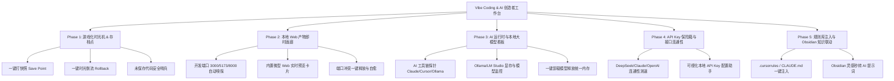

# 🚀 Workstation Monitor — Vibe Coding & AI 创造者工作台演进路线图 (Roadmap)

> **产品愿景**：从传统的“系统与网络底层监控台”，全面进化为**专为 Vibe Coding（氛围感编程 / 纯自然语言写代码）与 AI 初学者量身定制的本地副驾总控台 (AI Studio Cockpit)**。
>
> 核心理念：**零终端门槛、无感环境管理、游戏化时光存档、产物即时画廊、规则与灵感直达**。

---

## 🎯 核心目标与痛点

对于使用 **Claude Code、Cursor、Windsurf、Antigravity、Bolt** 等工具进行 AI 编程的开发者与初学者而言，最大的痛点是：
1. **改崩代码不敢回滚**：不懂复杂的 `git rebase` / `git reset --hard`，AI 写崩了手足无措。
2. **端口占用与冲突**：经常遇到 `Port 3000 is already in use`，找不到哪个后台服务在占端口。
3. **不知道 AI 报错原因**：到底是代码 Bug、API Key 欠费/失效、还是本地梯子网络超时？
4. **本地模型与显存黑盒**：跑了 Ollama / DeepSeek 本地模型，不知道占了多少显存，电脑发烫不知如何释放。
5. **多项目产物缺乏聚合**：同时开着几个前端和后端 demo，需要在多个终端和浏览器标签页之间反复横跳。

---

## 🗺️ 功能模块规划蓝图 (Feature Blueprint)

---

## 📦 详细分期规划

### 🎮 Phase 1: 游戏化“时光机”与存档点系统 (Vibe Git & Snapshots)
* **📸 一键打快照 (Save Point)**
  * 在 UI 顶部或 Git 卡片上提供显眼的「记录此刻好用状态」按钮。
  * 自动记录时间戳、修改摘要，并在后台生成轻量 Tag / Commit，给用户最直观的“存档列表”。
* **⏪ 一键时光倒流 (Rollback to Last Working State)**
  * AI 把代码写崩时，小白无需输入任何 Git 命令，点击即可将代码恢复到任意历史快照。
* **🛡️ 误操作安全拦截器**
  * 在执行任何清理或重置操作前，自动生成隐式备份，杜绝意外丢代码。

---

### 🖼️ Phase 2: 本地 Web 产物即时画廊 (Live Artifacts & Port Auto-Healer)
* **🔍 开发服务自动发现**
  * 自动监听并识别本地活跃的 Web 端口（如 `3000`, `5173`, `8000`, `8080`, `9528`）。
  * 识别服务类型（Vite / Next.js / React / Vue / FastAPI / Flask / Node.js）。
* **🖼️ 即时画廊与内嵌预览 (Mini Live Preview)**
  * 在工作台上生成微型画廊卡片，展示当前网页实时画面与 HTTP 状态。
  * 支持一键在默认浏览器打开或弹出无边框浮窗预览。
* **⚡ 端口一键解救 (Port Auto-Healer)**
  * 出现端口冲突时醒目标红，显示“由进程 [PID: xxx, Vite] 占用”，提供「一键腾出端口并重启服务」。

---

### 🧠 Phase 3: AI 运行时与本地大模型监控 (AI Runtime & Local LLM Hub)
* **🤖 AI 工具链全景探针**
  * 实时检测系统中已安装的开发与 AI 环境：
    * AI Agents: `Claude Code (claude)`, `Cursor`, `Windsurf`, `Antigravity`
    * 本地引擎: `Ollama`, `LM Studio`, `Docker`
    * 运行时: `Node.js`, `Python`, `Rust`, `Git`
* **📊 本地模型 (Ollama) 显控面板**
  * 自动连接 `http://localhost:11434`，读取当前已加载的模型名称（如 `deepseek-r1:14b`, `qwen2.5-coder`）。
  * 实时展示 Apple Silicon 统一内存（Unified Memory / GPU VRAM）占用。
  * 提供「一键卸载模型释放显存」按钮，防止电脑卡顿发热。

---

### 🔑 Phase 4: API Key 安全保险箱与接口体检 (API Key & Latency Radar)
* **📡 全球主流 LLM API 连通性测速**
  * 一键发起对以下服务商 API 的连通性与时延诊断（排查梯子或代理问题）：
    * Anthropic (Claude)
    * OpenAI (GPT-4o)
    * DeepSeek (深度求索)
    * Google Gemini
    * OpenRouter / SiliconFlow (硅基流动)
* **🛡️ 本地环境变量安全配置助手**
  * 可视化录入 API Key，一键写入用户环境（`~/.zshrc`）或当前项目目录的 `.env`。
  * 界面全自动脱敏（如 `sk-ant-api03-****`），防止录屏或直播时泄露。

---

### 📝 Phase 5: 提示词、规则库与 Obsidian 深度联动 (Rules & Prompt Ammo Hub)
* **📋 `.cursorrules` / `CLAUDE.md` 规则一键注入中心**
  * 内置高质量场景模板库：
    * *“全栈现代风格：Tailwind + SolidJS / React + TypeScript”*
    * *“严谨安全模式：严格类型、禁止硬编码、中文注释”*
    * *“极简 MVP 模式：快速出原型、单文件交付”*
  * 选择本地项目路径，一键注入标准 Rules 文件。
* **💡 现有 Obsidian 知识库深度共振**
  * 利用已完成的 Obsidian 模块，将日常记录的“产品想法 / UI 参考 / 报错经验”，一键转为格式化的 Prompt 复制给 AI。

---

## 🎨 交互与设计升级原则 (UX Principles)

1. **去术语化 (Human-Friendly)**：将 `SIGKILL`、`TCP ESTABLISHED`、`pcap Packet Stream` 等底层硬核概念，用「卡死急救」、「活跃连接」、「网络流量」等直观语言呈现；底层功能保留在“高级视图”中。
2. **状态可视化 (Visual Feedback)**：广泛运用状态指示灯（🟢 正常 / 🟡 警告 / 🔴 异常）、进度波形和卡片化网格。
3. **单二进制极速交付 (Single Binary & Zero Deps)**：所有新功能严格继承 Rust 后端 + 内嵌 SolidJS 前端的架构，零安装外部依赖，开箱即用。

---

## 📅 版本实施里程碑建议

### Intelligent Workstation Kernel — Milestone 1

- [x] 版本化工作站事件与操作契约
- [x] 内嵌 SQLite 持久化、事件保留与存储失败内存降级
- [x] 风险分级、短时单次确认凭据与幂等操作审计
- [x] 兼容现有接口的统一本机操作注册表
- [x] 可过滤、关联分组的活动时间线
- [x] 全局 `⌘K` 强类型命令面板与双语无障碍交互
- [ ] Rule Engine、Agent Command Center 与健康诊断
- [ ] macOS 原生菜单栏模式
- [ ] LAN 发现、配对、设备身份与远程操作

| 版本 | 重点交付模块 | 预期成果 |
| :--- | :--- | :--- |
| **v0.2.0** | **项目时光机 (Save Point) + 端口解救自愈** | 小白写代码防翻车，一键存档与无痛回滚；端口冲突秒解决 |
| **v0.3.0** | **本地 Web 产物即时画廊 + AI 接口连通性测活** | 直观看到所有正在跑的前端/后端服务；一秒排查 API 网络与 Key |
| **v0.4.0** | **Ollama 本地大模型显存监控 + Rules 规则一键注入** | 本地模型一键控温释放显存；一键为项目配置最佳 Cursor/Claude 规则 |
| **v1.0.0** | **全功能 Vibe Studio 完整版** | 完整的 AI 创造者本地专属驾驶舱与桌面 App |
